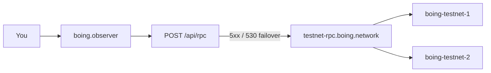

# 🔭 Boing Observer — Blockchain Explorer

Browse blocks, transactions, accounts, QA, and native DEX on **Boing Network**. Live at **[boing.observer](https://boing.observer)**.

> 👋 **Everyday users:** paste a block height, block hash, or 64-character account into search. Testnet is the default. Get coins at [boing.network/faucet](https://boing.network/faucet).  
> 🛠️ **Developers:** Next.js 15 App Router. Browser traffic goes through same-origin `POST /api/rpc` (CORS-safe). Direct node calls happen only on the server.  
> 🛰️ **Operators:** `NEXT_PUBLIC_TESTNET_RPC` defaults to `https://testnet-rpc.boing.network/`. Upgrading a laptop node does **not** change production explorer RPC.



## ✨ What you can do

| Surface | URL | What it is |
|---------|-----|------------|
| 🏠 Home | `/` | Chain height, latest blocks, search |
| 🧱 Block | `/block/:height` or `/block/hash/:hash` | Header + transactions |
| 👤 Account | `/account/:address` | Balance, nonce, stake (32-byte hex) |
| 📄 Transaction | `/tx/:txId` | Receipt when the node has one |
| ✅ QA transparency | [`/qa`](https://boing.observer/qa) | Live pool + public Allow/Reject voting |
| 📜 QA gate rules | [`/qa/rules`](https://boing.observer/qa/rules) | Every Allow / Reject / Unsure rule + PDF |
| 🧪 QA check | `/tools/qa-check` | Pre-flight `boing_qaCheck` |
| 💱 DEX | `/dex/pools`, `/dex/quote` | Read-only directory + CP quotes via `boing-sdk` |
| 📡 RPC catalog | `/tools/rpc-catalog` | Live `boing_getRpcMethodCatalog` |
| ❤️ Node health | `/tools/node-health` | Height, sync, optional `boing_health` |
| 📖 About | [`/about`](https://boing.observer/about) | Six pillars PDF |

Network selector: **Testnet** by default. **Mainnet** only appears as live when `NEXT_PUBLIC_MAINNET_RPC` is set to a **distinct** URL — never the testnet URL.

## 🧰 Tech stack

- **Next.js 15** (App Router), React 18, TypeScript
- **Tailwind CSS** with Boing design tokens (Comfortaa, dark theme, aqua/teal)
- **RPC** — Browser: same-origin `POST /api/rpc`. Server routes: direct HTTP. DEX tooling uses **`boing-sdk`** (synced from `boing.network` via `postinstall`)
- **Cloudflare** — OpenNext adapter → Workers; custom domain **boing.observer**

## 🚀 Setup

```bash
npm install --legacy-peer-deps
cp .env.example .env.local
npm run dev
```

Open [http://localhost:3000](http://localhost:3000).

```bash
npm run lint
npm run test
npm run build
npm run test:e2e
```

(`--legacy-peer-deps` is required because the Cloudflare adapter’s peer range can lag the Next 15 line we actually run.)

## ⚙️ Config

| Variable | Description |
|----------|-------------|
| `NEXT_PUBLIC_TESTNET_RPC` | Testnet RPC (default `https://testnet-rpc.boing.network/`) |
| `NEXT_PUBLIC_TESTNET_RPC_FALLBACKS` | Extra testnet origins (comma-separated). The proxy already failsovers to hosted Fly nodes |
| `NEXT_PUBLIC_MAINNET_RPC` | Mainnet RPC. **Leave unset** until a distinct mainnet endpoint is published |
| `BOING_OPERATOR_RPC_TOKEN` | Server-only; must match validator `X-Boing-Operator`. Never `NEXT_PUBLIC_` |
| `BOING_QA_VOTE_RPC` | Validator JSON-RPC for `boing_qaPoolVote` (defaults to `https://boing-testnet-1.fly.dev`) |

No API keys for read-only RPC. Do not hardcode production RPC URLs.

### RPC retries and “Method not found”

- Browser calls **`POST /api/rpc`**. Client retries **once** on network errors, HTTP 429, and 5xx. The proxy failsovers to Fly origins on **5xx/530**.
- There is **no** automatic failover on **`Method not found`**. `/qa` still shows **canonical QA JSON and doc links** when `boing_getQaRegistry` fails. See [THREE-CODEBASE-ALIGNMENT.md §2.1](https://github.com/Boing-Network/boing.network/blob/main/docs/THREE-CODEBASE-ALIGNMENT.md#21-qa-registry-rpc-boing_getqaregistry--two-different-surfaces).
- **`/dex/pools`** uses **`boing-sdk` against RPC** today. Optional Worker directory: [HANDOFF_NATIVE_DEX_DIRECTORY_R2_AND_CHAIN.md](https://github.com/Boing-Network/boing.network/blob/main/docs/HANDOFF_NATIVE_DEX_DIRECTORY_R2_AND_CHAIN.md).

## ☁️ Hosting on Cloudflare

```bash
npx wrangler login
npm run deploy
```

Attach **boing.observer** under Workers & Pages → **boing-observer** → Domains & Routes.

GitHub Actions deploys on `main` **after** CI (lint, unit tests, production build, Playwright) succeeds. Secrets: `CLOUDFLARE_API_TOKEN`, `CLOUDFLARE_ACCOUNT_ID`. Variables: `NEXT_PUBLIC_TESTNET_RPC`.

| Command | Description |
|--------|-------------|
| `npm run dev` | Local Next.js |
| `npm run build` | Production Next build |
| `npm run test:e2e` | Playwright (run `build` first) |
| `npm run preview` | OpenNext in Workers runtime |
| `npm run deploy` | Build and deploy to Cloudflare |

## 📚 Reference

- Protocol docs: `Boing-Network/boing.network` on `main` under `docs/`
- Alignment: [THREE-CODEBASE-ALIGNMENT.md](https://github.com/Boing-Network/boing.network/blob/main/docs/THREE-CODEBASE-ALIGNMENT.md)
- Local handoff: [HANDOFF.md](HANDOFF.md)

---

*Boing Network — Authentic. Decentralized. Optimal. Sustainable.*
